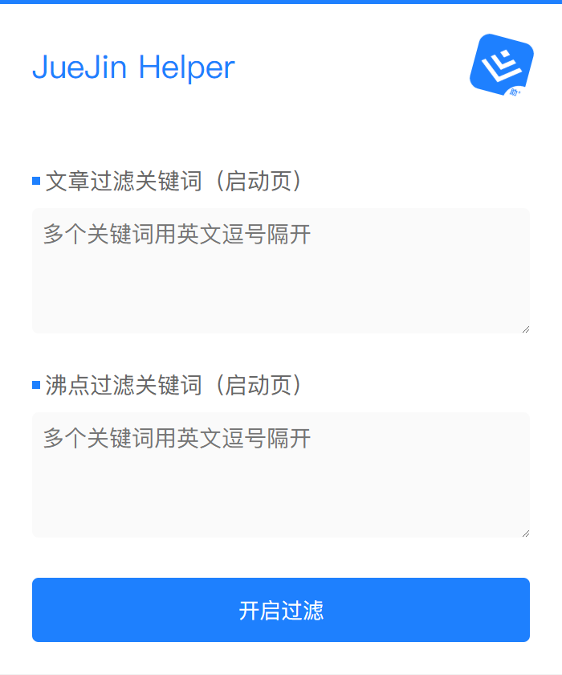

    
  

## Juejin Helper

一个支持自定义关键词过滤掘金启动页的文章/沸点的 Chrome 拓展，提升你的🐟体验

### 如何使用

1. Clone下载本项目到本地
2. 打开 Chrome 浏览器，输入 `chrome://extensions/` 进入扩展程序管理页面
3. 打开右上角的 `开发者模式`
4. 点击左上角的 `加载已解压的扩展程序`，选择本项目的根目录
5. 打开掘金首页，点击右上角的拓展图标，即可看到效果

    
  

